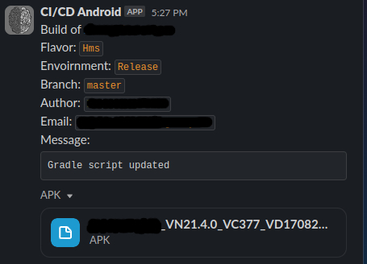
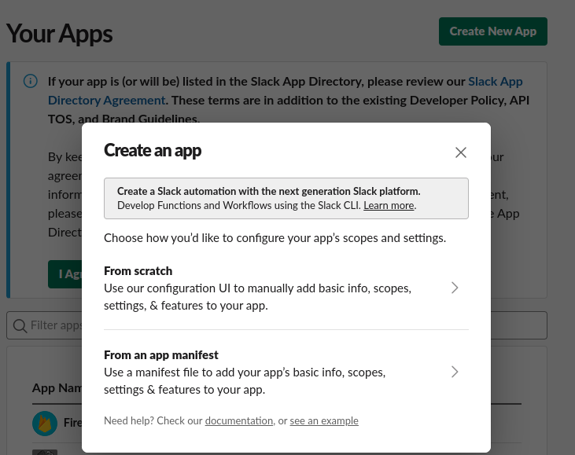
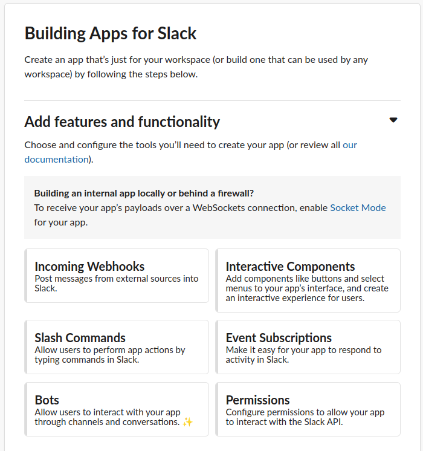
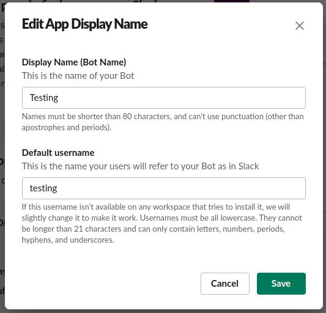
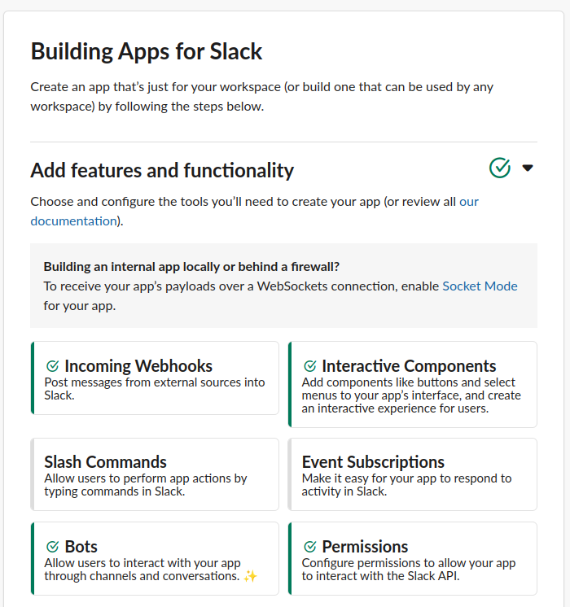
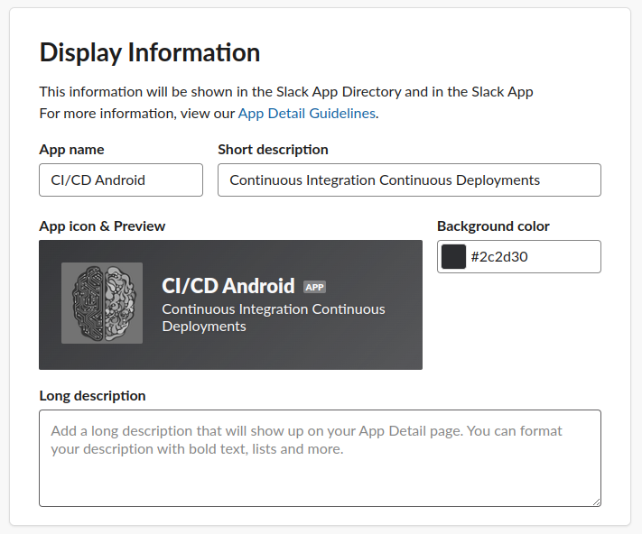
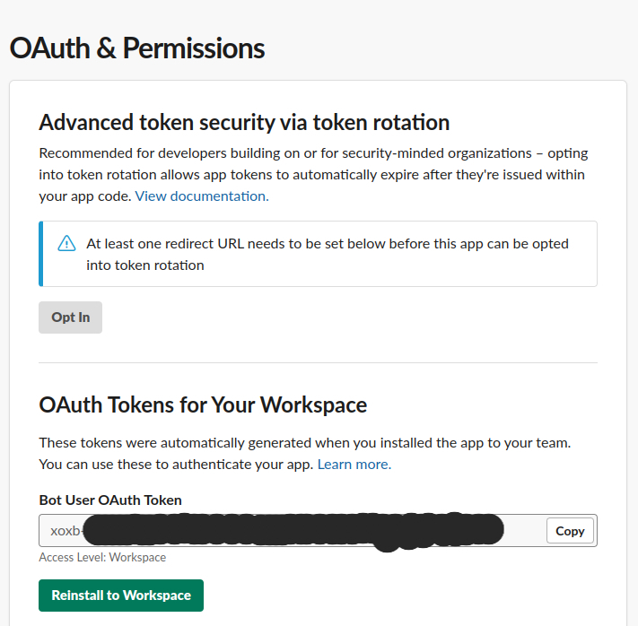
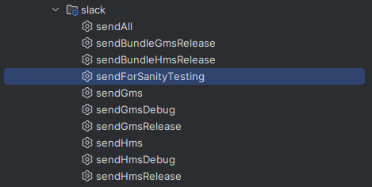

<div align="center">

<h1>Slack Gradle Android Plugin<br/><sub>Upload anything to a Slack channel with the help of Gradle task</sub></h1>

[📖 Documentation](#getting-started) |
[📆 Version History](https://plugins.gradle.org/plugin/io.github.fah33mk.slack)
[🫡 Credits: UPMC-Enterprises/gradle-slack-uploader-plugin](https://github.com/upmc-enterprises/gradle-slack-uploader-plugin)

```text
"Works to help you improve your CI and CD practices."
```

<hr />
</div>

<h2>🤬 Problem Statement</h2>
Optimize deployment by sharing software builds internally, reducing CI/CD costs for minor code changes.
<br></br>
**Efficient Workflow with Git Integration and Slack Notifications**

* In certain scenarios, immediately deploying new software from Git directly into production may not always be the most
  feasible approach. Likewise, utilizing valuable CI/CD build minutes for every minor code modification may not be
  the best utilization of resources. What if there was a way to streamline the process and share software builds
  internally without incurring the costs associated with CI/CD?

**Simplifying Deployment and Communication**

* Our innovative plugin will address this challenge by streamlining and optimizing the software deployment workflow.
  By leveraging Git integration and Slack notifications, it minimizes the effort needed to deliver software to your
  customers efficiently. With this approach, you can share builds within an intended internal group on Slack, saving
  both time
  and resources.

<h2>Key Benefits</h2>

1. **Unlocking Potential:** Diverse Applications of Our Plugin for Streamlined Workflows, Our versatile plugin offers a
   plethora of practical use cases that demonstrate its capability to enhance and optimize your workflow. Here are some
   noteworthy examples:

2. **Effortless Android App Deployment:** Streamline the deployment process by sending Android apps directly to the
   development team's channel for seamless uploading into the designated distribution store.

3. **Simplified QA Verification:** Accelerate the testing and verification phase by effortlessly uploading files to a
   dedicated QA channel, ensuring a smoother quality assurance process.

4. **Performance Insight with Build Artifacts:** Surface vital artifacts from a build, enabling a deeper understanding
   of its performance and aiding in strategic decision-making for future enhancements.

5. **Cost Savings and Efficient Resource Allocation:** Optimize resource utilization by judiciously using build minutes
   on your CI/CD platforms, resulting in cost savings and improved efficiency across the development pipeline.
   Explore the diverse applications of our plugin to experience a seamless integration into your existing workflow.
   Unleash the potential of enhanced efficiency, cost-effectiveness, and collaboration across your development
   endeavors.

<h2>📖 Found A Solution On Web</h2>
Discover an Optimal
Solution: [UPMC-Enterprises/gradle-slack-uploader-plugin](https://github.com/upmc-enterprises/gradle-slack-uploader-plugin).
Effortlessly share a single build on Slack for streamlined collaboration.

<h2>☹️ But</h2>In our organization with a multi-flavor architecture app, I needed a solution to upload multiple builds
effortlessly.

<h2>🚀 Our Innovative Improvements 🚀</h2>

1. Streamlined Multi-Variant & Flavored Build Sharing
2. Automatic Detection of Flavors, Creating Android Studio Tasks Accordingly
3. Enhanced Messaging: Now Includes Git Author Details, Commit Messages, Build Information, and Variant Specifics

<h2>😍 Outcome:</h2>
Whenever a file is uploaded, you can expect it to feel very familiar and flexible:

<div align="center">



</div>

# Getting Started

There are two parts to installing this plugin. The first part is for creating a Slack bot account with which the plugin
uses to upload a file and the second part is, of course, installing it into your Gradle script.

## Create the Slack Bot

Unless your Slack administrator has banned unapproved apps from being installed into your workspace, then just about
anyone should be able to follow these steps.

1. Go to [api.slack.com/apps](https://api.slack.com/apps/)
1. Press the *Create New App* button. Apps within Slack enable automated bots to post messages to a Slack channel.
1. In the pop-up dialog, give the app a friendly name. This name is for your reference only and is not reflected as the
   bot's name in a Slack workspace whenever it posts a message. You will configure the bot's name later.

    

1. After creating the app, click on the *Bots* button, under the *Add Features and Functionality* section

    

1. Click the *Add a Bot User* button and fill out the form. The Display Name is effectively the bot's First and Last
   Name, which appears as the sender of a Slack message. You can populate this form as you please. Here is an example
   set up:

    

1. Save your changes and the go back to the *Basic Information* page, which is available from the left-column navigation
1. Under the *Add Features and Functionality* section, both the *Bots* and *Permissions* features should show as
   completed

    

1. **(Optional)** Populate the *Display Information*. This can be thought of as the bot's profile picture and status
   message.

    

1. Click on *Install Your App to Your Workspace* and follow Slack's installation and permission prompts
1. After installing the app, go back to the app's configuration
1. On the left-column navigation go to *OAuth & Permissions*
1. Make a note of the *Bot User OAuth Access Token* (not the OAuth Access Token). You will need this for a subsequent
   step. **Keep this token safe, as having access to it enables anyone to send messages to your workspace.**

    

## Install the Plugin into Gradle

After adding a bot account to Slack, we now have enough information to add the plugin to Gradle.

### Using the Plugins DSL (Recommended)

Newer version of Gradle support the
updated [plugin DSL](https://docs.gradle.org/current/userguide/plugins.html#sec:plugins_block). These steps show how to
install the plugin with this technique.

1. Note the latest release of this plugin for use in the next step:
1. Open your `build.gradle` file, and add this code to load and apply the plugin:

    ```groovy
    plugins {
        id "com.faheem.gradle.slack" version "1.0.5"
    }
    ```

### Using the Legacy Plugin Application

Older versions of Gradle do not support the
modern [plugin DSL](https://docs.gradle.org/current/userguide/plugins.html#sec:plugins_block). Use this technique if the
above approach fails.

1. Note the latest release of this plugin for use in the next step:
1. Open your `build.gradle` file, and add this code to load and apply the plugin:

    ```groovy
    buildscript {
        repositories {
            maven { url "https://plugins.gradle.org/m2/" }
        }

        dependencies {
            classpath "com.faheem.gradle.slack:slackGradleAndroidPlugin:1.0.5"
        }
    }
    ```

1. Now, apply it:

    ```groovy
    apply plugin: "com.faheem.gradle.slack:slackGradleAndroidPlugin"
    ```

### Using JitPack (Not Recommended)

For the sake of convinence, this plugin is also available on JitPack. These steps show how to install the plugin from
there.

1. Note the latest release of this plugin for use in the next
   step: [Latest Release - 1.0.6](https://plugins.gradle.org/plugin/io.github.fah33mk.slack)
1. Note the stable release of this plugin
   is: [Stable Release - 1.0.5](https://plugins.gradle.org/plugin/io.github.fah33mk.slack)
1. Open your `build.gradle` file, and add this code to load the plugin:

    ```groovy
    buildscript {
        repositories {
            maven { url "https://jitpack.io" }
        }

        dependencies {
            classpath "com.faheem.gradle.slack:slackGradleAndroidPlugin:1.0.5"
        }
    }
    ```

1. Now, apply it:

    ```groovy
    apply plugin: "com.faheem.gradle.slack:slackGradleAndroidPlugin"
    ```

# Configuring the Plugin

There are a few ways you can use this plugin, depending on your needs. You may wish to adapt how you use this based on
your setup. Before diving into the code, let's cover what this plugin offers:

- **Configuration Block For Single Build Upload:** You must *always* configure this plugin with a block since it has
  required paramters:

    ```groovy
    uploadFileToSlack {
        ...
    }
    ```

  Otherwise, your build will fail with an exception until the necessary information is provided.
- **Task:** To manually kick off an upload task, run the `uploadFileToSlack` task, like so:

    ```bash
    ./gradlew uploadFileToSlack
    ```

  Keep in mind you'll probably want a few commands beforehand to run a build and generate artifacts.

## Configuration Block Options

There are several parameters which are provided to alter the behavior of the plugin. Here is an example of a fully
configured block:

```groovy
uploadFileToSlack {
    comment "Our app is ready for release!"
    channels "public-release-channel", "developers"
    enabled true
    filePath "build/outputs/apk/release/app-release.apk"
    token GRADLE_SLACK_UPLOADER_PLUGIN_TOKEN ?: "" // Defined in the global gradle.properties file
}
```

Here is an elaboration of each of these options:

| **Option** | **Default** | **Required** |                        **Description**                        |
|:----------:|:-----------:|:------------:|:-------------------------------------------------------------:|
| `comment`  |   *None*    |      ✅       | The comment which is shown above the file attachment in Slack |
| `channels` |   *None*    |      ✅       | Comma separated list of channels which will receive the file  |
| `filePath` |   *None*    |      ✅       |  Path of the artifact to upload relative to the project root  |
|  `token`   |   *None*    |      ✅       |                Slack bot's OAuth access token                 |


## Flavour & Variant Based Upload Tasks

### Write/Add Script to support multi flavour and variant support

1. Create a `.gradle` file into your project
2. Add this [slack.gradle](scripts/slack.gradle) into your android project.
3. This file will create multiple tasks into your gradle scripts which will include
    1. Variant based single or multiple `apk` uploader
    2. Flavour based single or multiple `apk` uploader
    3. Variant based single or multiple `bundle` uploader
    4. Flavour based single or multiple `bundle` uploader
    5. One task to send all the variants and flavoured apk's
    6. Before creating build it run all tests in the project
4. Go into your app level `build.gradle` file and add `apply from: 'slack.gradle'`

### Sync Project & Open Gradle Task List

1. Once project sync is completed open gradle tab in your android studio. Make sure that on sync all the gradle tasks
   are being created. If you are not sure
   see [Gradle Task is Missing on Android Studio](https://medium.com/@mockreader/gradle-task-is-missing-on-android-studio-4-2-f7838bc22909).
2. Once you get all the task list look for a group/folder named as `slack`
3. Expand or open
4. You will see all the list of tasks as given below:

<b>Note:</b> in this example I had two flavours

1. GMS (Builds for Devices having Google Play Services)
2. HMS (Builds for Devices having Huawei Mobile Services)



### Task `sendForSanityTesting`

This task is created when after all the development & testing is completed you the final testing of the builds and get
ready for deploy.
This task will share below list of builds

1. All flavours Release APK
2. All flavours Release Bundle

### Run
1. Double-click on any script form the list
2. Manually start a task e,g `sendAll` 
    ```bash
    ./gradlew sendAll
    ```
   
Note: The tasks will run `assemble`, `bundle` and `tests` scripts by itself so you don't need to call them first to upload any build.
<h1>👨🏽‍💻 About Me</h1>

Greetings! I'm **Faheem Ahmad**, the developer behind the Slack Gradle Android Plugin. I'm passionate about streamlining workflows and optimizing software deployment processes. The Slack Gradle Android Plugin is a testament to that passion, designed to enhance collaboration and communication within your development team.

This plugin emerged from the need to efficiently share software builds within a team, saving valuable time and resources. By integrating with Git and Slack, it facilitates seamless deployment and helps you make informed decisions based on performance insights from build artifacts.

Feel free to reach out to me via email for any inquiries, suggestions, or feedback regarding the Slack Gradle Android Plugin. Let's collaborate and enhance your development endeavors!

Contact:
<b>**[Email](faheem.a1992@gmail.com)**, **[LinkedIn](https://www.linkedin.com/in/fah33mk/)**</b>